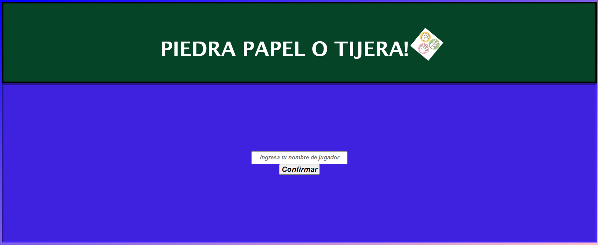
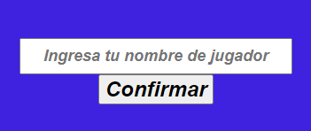
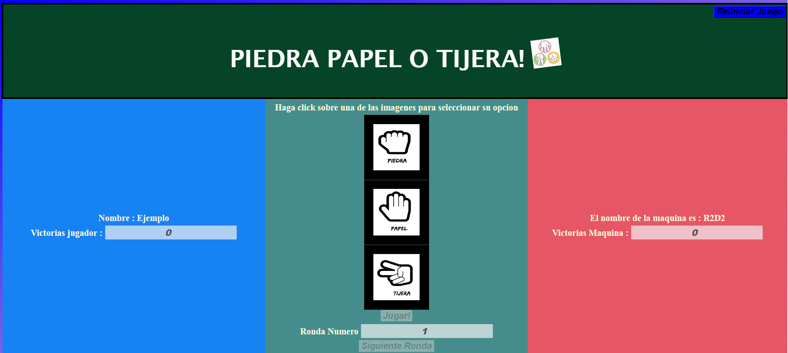
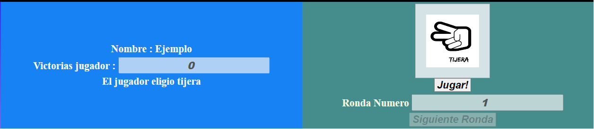
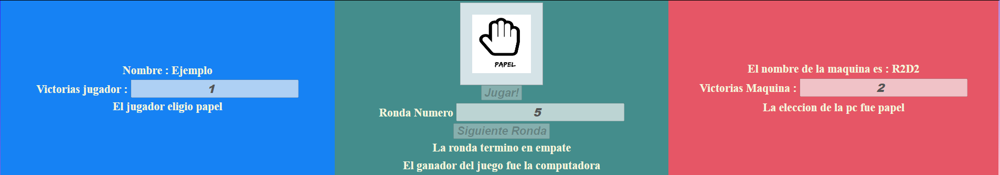

# Piedra Papel o Tijera ! 
* El proyecto se basa en recrear el juego piedra papel o tijera, esta vez utilizando React
* para ello se despliegan las imagenes en la pantalla (a modo de menu), donde el usuario debe hacer click en una de ellas para seleccionar su opcion deseada 
* Se generara de manera aleatoria la opcion de la computadora, y basandose en las reglas basicas del piedra papel o tijera, se definira un ganador 
* El juego se desarrolla al mejor de 5 rondas, es decir, si uno alcanza las 3 victorias se da por finalizado el juego y se declara el ganador 
* Las rondas que terminen en empate no suman puntos para ninguna de las partes, y si se llega a la ronda 5 sin que ninguno de los adversarios llegue a las 3 victorias, se evalua el que mayor numero de victorias que tenga cada uno y se declarara el ganador del juego, o en su defecto, el empate 

## Manual de uso
1. Vista general de la pagina

  

2. Inicio

El primer paso, es dirigirse al espacio reservado para ingresar su nombre

 
 

La pagina pedira ingresar un nombre, que debera contener mas de 4 caracteres, en caso contrario, emergera un mensaje de error
Una vez ingresado un nombre valido, la interfaz cambiara, exponiendo la forma final del juego

 
 

3. Conociendo la interfaz 
 el juego contra de 3 zonas que son las siguientes:
+ zona del jugador: donde se visualizan tanto el nombre del jugador, la cantidad de victorias que lleva. Una vez realizada la eleccion, se mostrara en texto cual fue la opcion elegida
+ zona de informacion y eleccion: aqui se muestra una breve instruccion para comenzar a jugar, se despliegan las distintas opciones a elegir, el numero de ronda y en el futuro, se podran visualizar los resultados tanto de las rondas, como del juego en general
+ zona de la computadora: al igual que la zona del jugador se muestran los mismos campos

En la parte superior derecha, se muestra un boton que nos llevara a reiniciar el juego

4. Demostracion del juego

Siguiendo las instrucciones, el jugador "selecciona" una de las opciones, haciendo click sobre ella, en este ejemplo se elegira tijera

Una vez seleccionada la opcion, sera la unica opcion que quede visible; en el lado del jugador se imprimira  cual fue la opcion seleccionada; de manera paralela se obtiene la opcion de la computadora
    
Luego se procede a clickear sobre el boton jugar, que mostrara el resultado de la ronda, incrementando el contador de victorias del ganador o no, si la ronda resulta en empate

El siguiente paso es avanzar a la siguiente ronda, una vez selecciona esa opcion, la interfaz volvera a la apariencia mostrada en el punto 2

5. Resultado final

En esta prueba la computadora resulto victoriosa en la  quinta ronda , como se muestra a continuacion

Una vez finalizado el juego, se muestra el resultado de la ultima ronda y del juego en general. Si se desea volver a jugar, simplemente se hace click sobre el boton de reiniciar, volviendo al punto 1

6. Pendientes
* Mejorar el codigo, agregar mas componentes, dividiendo los que se hicieron en esta etapa
* Se podria separar los estilos de los componentes, para tenerlos en archivos distintos
* Con respecto al juego agregar la funcionalidad que detecte el ganador de manera mas precisa. Por ejemplo, si un jugador, una vez finalizada la ronda 4 va 2-0, no hay posibilidad que el otro jugador llegue siquiera a alcanzar el empate, de manera que terminada esa ronda, ya declararia un ganador. Con las condiciones actuales no se logra eso.
* Se podria agregar la lista de imagenes de las opciones de la computadora, o agregar que se vea la imagen de su eleccion, como en la version del practico 2
* Eliminar el boton de jugar, es decir que una vez que el jugador realice su eleccion, se generen los resultados
